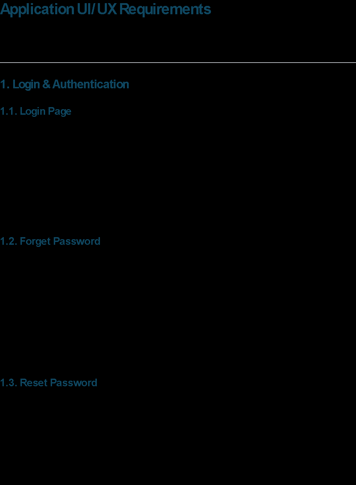

# Application UI/UX Requirements

This document outlines the user requirements and component structure for the application.

---

## 1. Login & Authentication

### 1.1. Login Page
- **User Story:** As a user, I want to log in with my credentials (email and password) so that I can securely access the application.
- **UI Components:** Form with input fields for email and password, a "Login" button, a "Remember Me" checkbox, and a link to "Forgot Password".
- **Acceptance Criteria:**
  - Users must enter a valid email and password.
  - An error message is displayed for invalid credentials.
  - On successful login, the user is redirected to their default dashboard.

### 1.2. Forget Password
- **User Story:** As a user who has forgotten my password, I want to request a password reset link so that I can regain access to my account.
- **UI Components:** A modal or separate page with a form to enter the registered email address.
- **Acceptance Criteria:**
  - User enters their email address.
  - The system validates if the email exists.
  - A password reset link is sent to the registered email address.
  - A confirmation message is displayed to the user.

### 1.3. Reset Password
- **User Story:** As a user, I want to use the reset link from my email to set a new password for my account.
- **UI Components:** A form to enter and confirm the new password.
- **Acceptance Criteria:**
  - The password reset link is single-use and expires after a configured time.
  - The form enforces password strength requirements (e.g., length, complexity) and provides feedback.
  - The user is notified of a successful password change and redirected to the login page.

---

## 2. Dashboards & Reporting

### 2.1. Executive Dashboards
- **User Story:** As an executive or manager, I want a high-level overview of key risk metrics at a glance to quickly assess the business's health.
- **Description:** The main landing page for managerial roles, providing a snapshot of critical information.
- **UI Components:** A grid of widgets/cards and charts.
  - **Alerts Summary:** A pie or donut chart showing the proportion of Open, WIP, and Closed alerts.
  - **Open Alert Count:** A KPI card displaying the total number of open alerts. Clicking it navigates to the filtered Alerts Dashboards.
  - **WIP Alert Count:** A KPI card for "Work in Progress" alerts. Clicking it navigates to the filtered Alerts Dashboards.
  - **Closed Alert Count:** A KPI card for closed alerts. Clicking it navigates to the filtered Alerts Dashboards.

### 2.2. Analytics View
- **User Story:** As a fraud analyst, I want to analyze transactional data across different risk categories to identify patterns and potential fraud.
- **Description:** A dedicated section for in-depth analysis, likely with a tabbed interface for different metrics. A global date range filter should apply to all analytics views.
- **UI Components:** Tabs, Line/Bar charts for trends, Data tables for ranked lists.
  - **Tabs:** Refunds, Discounts, Price Override, Voids/Cancels.
  - **For each tab:**
    - A chart showing the trend of the metric (e.g., total refund amount) over the selected period.
    - A data table listing
  - Analytics - Post the PLACARDS, We want a high-risk store and cashier view
    - Refunds
    - Discounts
    - Price Override
    - Cancel
  - Risky Stores
    - Top 20 High Risk Stores
    - Outlier, trends by stores- Calculation to be done basis on the weightage, Current period vs previous , C. Month vs PM
  - Risky Cashiers
    - Outlier, trends by Cashiers- Calculation to be done on the weightage, C. Month vs PM Current period vs previous period
  - Drill Down View
    - By Store (for selected store)
      - Discount value
      - Cash over short value
      - Refund % of net sales
      - Cash refund amount by store
      - Cancel count %
      - Price override %
    - By Cashier (for selected cashier)
      - Refund % of net sales by cashier
      - Cash refund amount by Cashier
      - Cash over short by cashier
- Reports
  - Reports Creation
  - Custom Reports
  - CRUD
- Rules
  - Rule Viewer
  - Active Rules Count
  - Passive Rules Count
  - Create CRUD
  - Schedule
  - Trigger info Alert template
  - Rule Status @ exec log
  - Manage
- Alerts
  - Alerts Dashboards
  - Alert along with receipt
  - Transaction Finder
  - Link Analysis
- Agentic AI & Chat bot
  - Model builder
  - Prompt
- Cases
  - Case Dashboards
  - Case Viewer
  - Active Case Count
  - Passive Case Count
  - Create CRUD
  - Network Analysis
  - Trigger info Alert template
  - Case status @ exec log
  - Manage
- Control Panel
  - User Management
  - Roles & Access management
  - Integration
  - Job Management
  - Scheduler
  - Security
  - Billing
  - Logging
  - Analytics
  - Manage Views, filters, API & Parms etc
- shared
  - components
  - directives
  - pipes
  - imports
